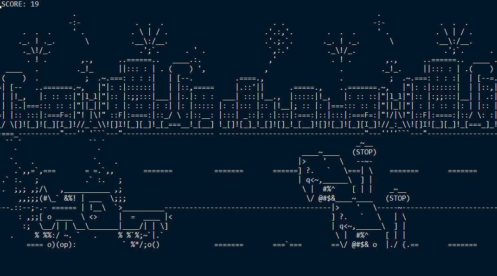

## Future racer
### Introduction

This is my project, written on C to **olc::Codejam2021**.
This game uses an ASCII art graphics, and command promt to display the output.



---

### Installation (Windows 10)

It works stably on the __Windows 10__ command line. In earlier OS versions, updating the command line may be slow.

- #### Step 1 - clone repository
First of all you need to clone repository. The following command to do it:

    git clone https://github.com/Nikita-bunikido/Future_racer.git

- #### Step 2 - compiling program
Then goto your local repository in command line. After this you should compile program.
You can do it like:
    
    gcc main.c -o main

If you haven't ```gcc``` compiler you can download installer [here](http://www.equation.com/servlet/equation.cmd?fa=fortran).


### Management

Basic management:
UP ARROW | DOWN ARROW | SPACE | ESCAPE | ENTER
:-:|:-:|:-:|:-:|:----:
go up | go down | shoot | exit | restart|

### How to play

In this game, you need to maneuver between barriers like robots, street lamps, and stop signs with boxes. Also if you can't bypass barrier, you can destroy it by shooting. If you crash into the barrier - game over. Goal - get as high number of score, as you can.

### Enjoy!